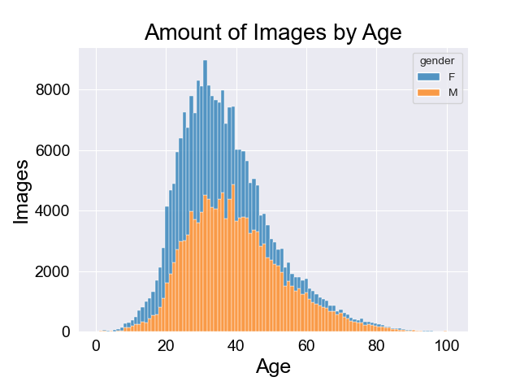
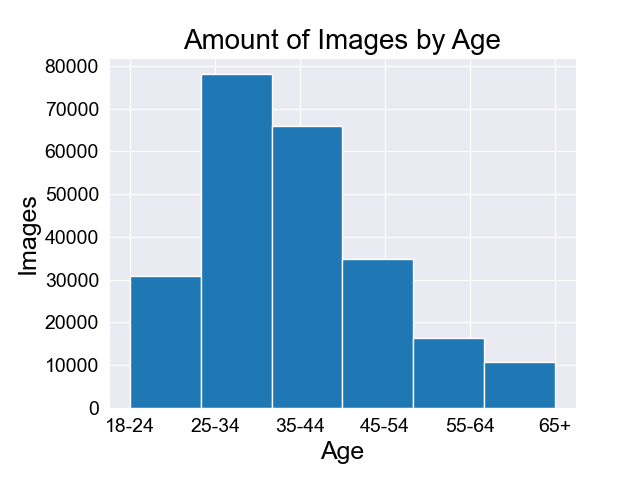
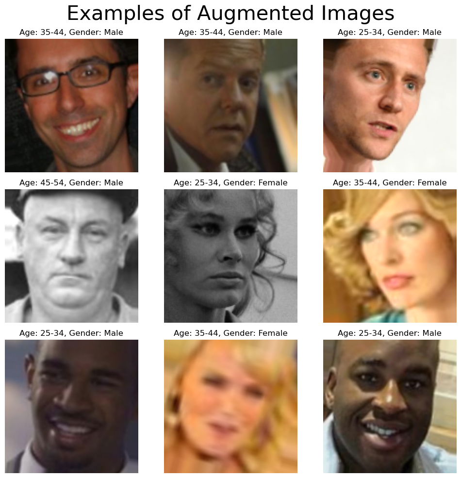
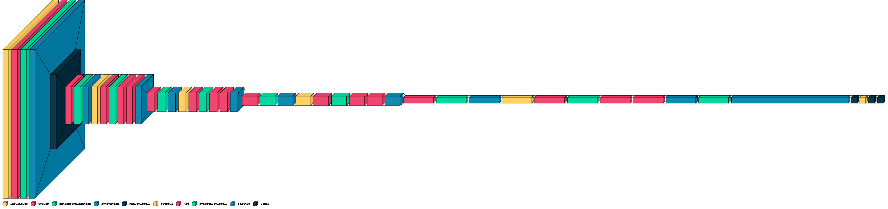
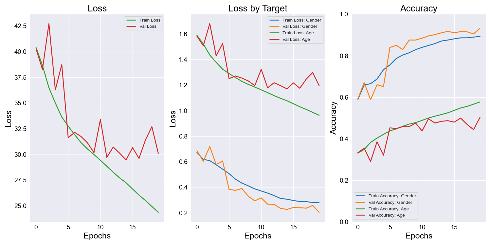

# **AutoID**
### Identifying Consumer Demographic Groups Via Facial Images
by Kevin Atkinson

**Try the [Streamlit App](https://kmatk-autoid-app-lcpx0a.streamlit.app/) for this project!**

## Overview
The aim of this project is to develop a deep learning model capable of classifying an individuals gender and age group using an image of their face. 

## Business Understanding
Two of the major factors in advertising products to consumers are age and gender. While there are many factors in ascertaining the most optimal product advertisements to serve to an individual, these two to encompass a large portion of the equation. In this project we will attempt to use images of individuals to classify their age and gender to better target ads to individuals. 

For many market segments, the subsets of customers who shop online vs in-store may vary significantly. The demogrpahics of customers who enter a retail location is highly valuable information. Using this information could help optimize highly valuable, highly limited shelf space. It can serve to inform decisions regarding end-cap and floor displays. It can also be used to serve targeted ads directly to consumers as they browse shelves for products. 

One such application for this technology would be a cosmetics retail store such as an Ulta or Sephora, where the age group highly influences purchasing decisions. 

Implementing this technology can serve to optimize advertising dollars, retail shelf space, as well as enable more granular inventory selection from location to location.

## Data Understanding

Our data is being sourced from the [B3FD](https://github.com/kbesenic/B3FD) dataset. B3FD stands for Biometrically Filtered Famous Figure Dataset. Introduced in the paper [Picking out the bad apples: unsupervised biometric data filtering forrefined age estimation](https://link.springer.com/epdf/10.1007/s00371-021-02323-y?sharing_token=z1NicVj4Fy7P340TvNARsPe4RwlQNchNByi7wbcMAY6I9f3BJkfEnl_nOTlEIb8Wo61IlQRlpMJvoIBvErNdzQVjHI_iw8GtkfEtU2GkEZUAH1OPj6rD6vzQM6L0QxHaTNktc-rMcuc7CpaKb-DYU5QZuxSyGKUtAzk9EUTpuwo=), the data consists of over 375,000 images of famous individuals derived from the [IMDB-WIKI](https://data.vision.ee.ethz.ch/cvl/rrothe/imdb-wiki/) and [CACD](https://bcsiriuschen.github.io/CARC/) datasets. The subjects of the images are 53,759 unique individuals, ranging in age from 0 to 101 years old.

We will be using subsets that have the classification targets of Age and Gender. This is because these are the minimum viable details in order to have reasonably successful targeted advertising. These images have been pre-aligned, and cropped to contain 50% context, as well as resized to be 256x256. You can download the dataset here: images: [B3FD_images.tar.gz](https://ferhr-my.sharepoint.com/:u:/g/personal/kbr122017_fer_hr/EU4lr6xf_ZhBi9vN_i8h_XEByhasE-qqKlcC7iqk5K9XtQ?e=Yox63W), metadata: [B3FD_metadata.tar.gz](https://ferhr-my.sharepoint.com/:u:/g/personal/kbr122017_fer_hr/EcKiZtbTTb5Ep-fN32wCx4oBIcY64Wr8JhxlgPkV33M7cg?e=Q6NtUX).

Because these images have already been cropped cropped to contain 50%+ context (read: face), in its current form this project will be unsuitable for real-world deployment. Prior to deployment we will require an additional step of locating faces within images, cropping the images to the facial bounding box, and then passing that cropped image to our model. That said, what we create will be a vital cog in the gearbox of our AutoID system. 

It was informative to develop a deeper understanding of our dataset. Namely, the way in which ages were distributed by gender. There are 40% more images of males than females within our subset. In addition, the  median female image is 6 years younger than the median male image.



## Data Preparation  
What would otherwise be a regression problem was converted into a classification problem by binning our ages into 6 traditional marketing age groups. During this process all images of individuals under 18 years old were dropped. These bins were then converted to one-hot encoded lists to serve as age group targets for each of our images. The gender targets were then made to binary targets.

We created several functions to generate augmented images to be fed to the model, plot the results of our models, display examples of the output of our image generators, as well as construct the models themselves.





## Modeling 
We built a residual neural network (RNN) to classify the images within our dataset. Residual Neural Networks utilize "residual connections" to increase training performance in models with many layers. You can read about them more [here](https://arxiv.org/pdf/1512.03385.pdf). Our RNN has a dual target output, one for our age target and the other for the gender target. The best and  final model also contained [dropout](https://arxiv.org/pdf/1207.0580.pdf) regularization and batch normalization. This model contained more than 25 layers with in excess of 25 million parameters.



## Evaluation
Due to time constraints we were unable to train until our lose plateaued. That said, on unseen data, we achieved a gender accuracy of 93%, and an age accuracy of 50%. These metrics are much better than our baseline models 59% and 39% respectively. With further training these scores can yet be improved. 

It seems as though our validation accuracy may have begun to diverge from our training accuracy. It's also possible that including gender loss weights to our optimizer may have caused the model to begin to overfit the gender target. As a preview to next steps, this is something we can iterate on. 



## Deployment
As a demonstration of what our model is capable of we created a Streamlit app which is capable of receiving images and outputting a gender and age classification. Bear in mind that for best results the images should contain greater than 50% facial context. This app can be found [here](https://kmatk-autoid-app-lcpx0a.streamlit.app/).

Here's a preview of the app in action:  


https://github.com/kmatk/AutoID/assets/16636321/5e32a1e7-b157-4e67-9dc6-6abb77d9755a


## Conclusion
All in all, we gathered and prepared a massive dataset, built functions for analysis and model imputation, and build multiple very large and complex multi-target deep learning models capable of reasonably accurate classification of images. This model and its progeny may well serve to inform marketing decisions for retailers in the near future.

## Next Steps
- Our model is limited in the types of images it can reasonably classify because it was trained on images with all contain greater than 50% context. We can improve this by creating a dual model system where the first model identifies faces within images and generates bounding boxes with which to crop them. These cropped images can then be passed to our gender and age classifying model.
- We can increase the complexity of the data being fed to the model by using the full resolution images within the dataset rather than those we have reduced in size to 128x128, this will require much more computational power.
- To achieve the previous step we can utilize a cloud compute service such as AWS EC2 to train and iterate our models much more rapidly.

## Repository Structure
```
├── README.md
├── notebook.ipynb
├── presentation.pdf
├── [images]
├── app.py
├── requirements.txt
├── streamlit
│   ├── [model]
│   ├── style.css
│   └── background.jpg
├── .gitignore
└── LICENSE
```
